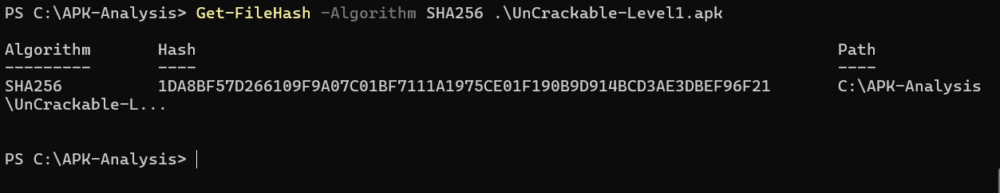
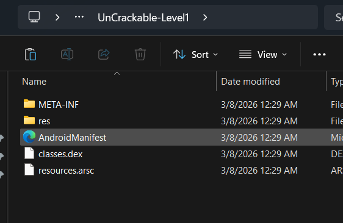
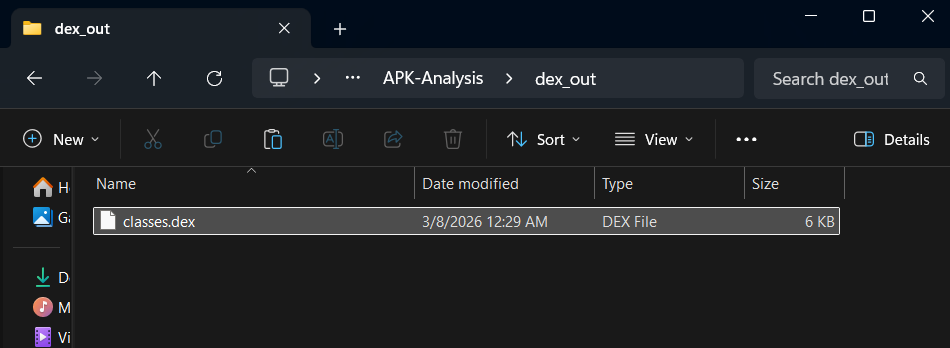
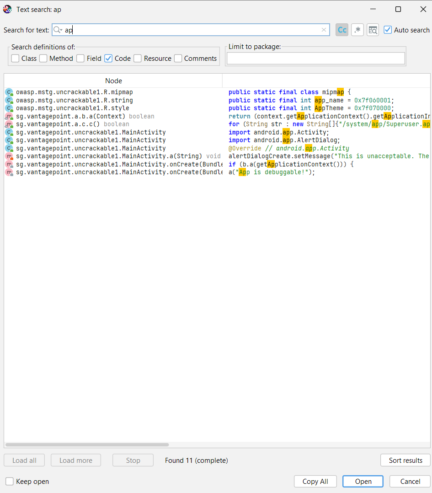
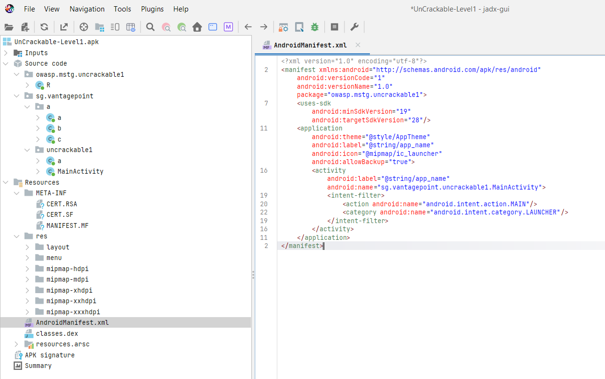
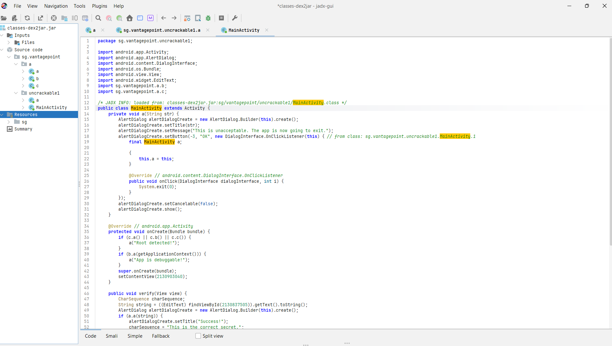
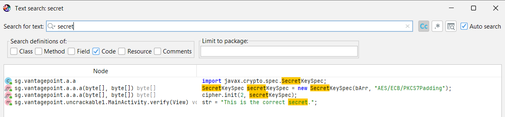
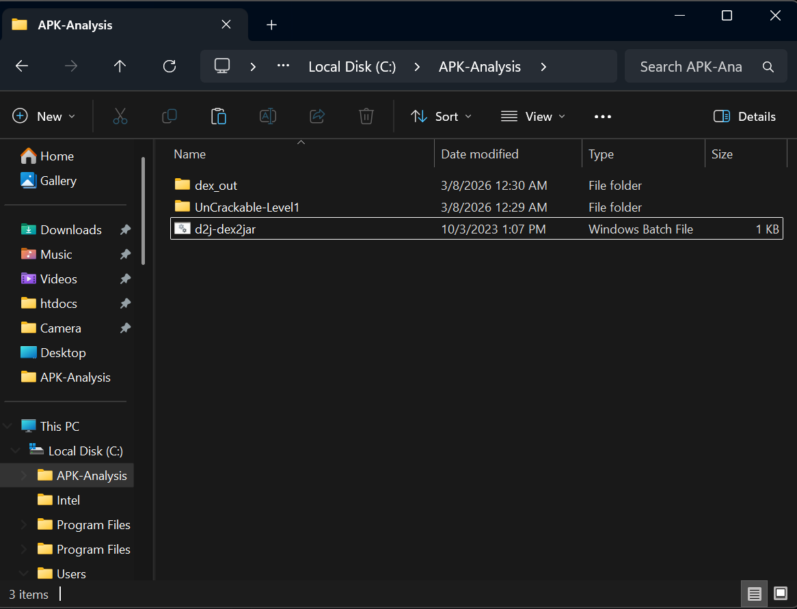

# Lab_4_MobileSecurity
## 1. Informations générales

* **Application analysée :** UnCrackable-Level1.apk
* **Type d’analyse :** Analyse statique d’un APK Android
* **Outils utilisés :** JADX GUI, dex2jar
* **Date :** 2026
* ** ** Erraouidate Ismail

---

## 2. Description de l'analyse

L'objectif de ce travail était d'examiner la structure interne d'une application Android sans l'exécuter.
L'APK a été ouvert et étudié avec l'outil **JADX GUI** afin d'observer le code décompilé, les ressources et le fichier **AndroidManifest.xml**.

L'analyse a permis d'explorer :

* la structure générale de l'application
* le fichier de configuration AndroidManifest
* le code source décompilé
* certaines chaînes de caractères présentes dans l'application

---

## 3. Structure de l’APK

L’archive APK contient plusieurs éléments importants :

* **AndroidManifest.xml** : configuration principale de l'application
* **classes.dex** : code compilé de l'application Android
* **res/** : ressources graphiques et fichiers XML
* **META-INF/** : informations de signature de l'application

---

## 4. Analyse du Manifest

Le fichier **AndroidManifest.xml** fournit des informations sur la configuration de l'application.

Informations observées :

* **Package :** owasp.mstg.uncrackable1
* **Activité principale :** sg.vantagepoint.uncrackable1.MainActivity
* **minSdkVersion :** 19
* **targetSdkVersion :** 28

L'application démarre à partir de l'activité **MainActivity** grâce à l’intent filter :

* `android.intent.action.MAIN`
* `android.intent.category.LAUNCHER`

---

## 5. Recherche de chaînes sensibles

Une recherche a été effectuée dans le code afin d’identifier des mots-clés liés à la sécurité.

Exemples de mots recherchés :

* debug
* secret
* password
* api

Une chaîne intéressante a été trouvée dans le code :

"This is the correct secret."

Cette chaîne indique que l'application vérifie une valeur secrète pour valider une action.

---

## 6. Constats de sécurité

### Constat 1 — Vérification du mode root

**Niveau :** Faible

L'application contient un mécanisme permettant de détecter si l'appareil Android est rooté.

**Impact :**
Ce type de protection peut parfois être contourné par un attaquant.

**Remédiation :**
Utiliser des mécanismes de protection supplémentaires contre la modification de l'application.

---

### Constat 2 — Détection du mode debug

**Niveau :** Moyen

Le code contient une vérification permettant de savoir si l'application est exécutée en mode debug.

**Impact :**
Un attaquant pourrait modifier l'application pour contourner cette vérification.

**Remédiation :**
S'assurer que l'application de production n'autorise pas le mode debug.

---

### Constat 3 — Chaîne secrète dans le code

**Niveau :** Moyen

Une chaîne liée à un secret est présente directement dans le code de l'application.

**Impact :**
Les informations sensibles présentes dans le code peuvent être récupérées via l'analyse statique.

**Remédiation :**
Éviter d'inclure des secrets directement dans le code de l'application.

---

## 7. Conclusion

L'analyse statique de l'application **UnCrackable-Level1** a permis d'examiner la structure interne de l'APK et d'étudier son code sans exécution.

Cette étude a révélé plusieurs mécanismes de sécurité présents dans l'application, notamment la détection du root et du mode debug, ainsi qu'une chaîne liée à un secret dans le code.

Ces observations montrent l'importance de protéger les informations sensibles et d'utiliser des mécanismes de sécurité adaptés lors du développement d'applications mobiles.

---

## Captures d'écran

### Vérification de l'intégrité de l'APK

### Structure interne de l'APK

### Extraction du fichier DEX

### Ouverture de l'APK dans JADX

### Analyse du fichier AndroidManifest

### Analyse du code MainActivity

### Recherche de chaînes sensibles

### Conversion DEX vers JAR

